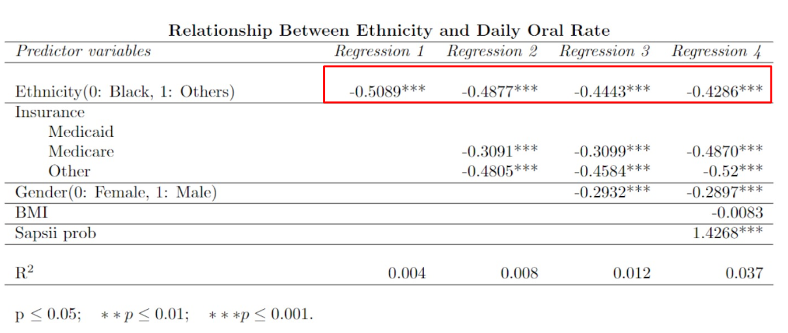

# Disparity of Care in Patients requiring Mechanical Ventilation in the ICU

Research has shown that black patients have an elevated rate of ventilator associated pneumonia (VAP). 
However, we have also discovered from the MIMICIV dataset that black patients are favoured when administrating oral care.
Therefore, we would like to study the association between ethnicity and frequuency of oral care received. 

# Methodology

We performed ANOVA test to verify statistical significance between oral care frequency between blacks and the other races.
We discovered that the ANOVA results indeed suggests disparity between frequency of care received by patients of different ethnicity.

# Potential Confounders

The team had went on to control the effects of potential confounders which would undermine the effect of ethnicity on the 
frequency of oral care received.  
Some of the confounder variables we have proposed includes:
- age
- gender
- bmi
- insurance possession
- sapsii probability

    

# Contributors

---
**Title**: Disparity of Care in Patients requiring Mechanical Ventilation in the ICU   
**Date**: 4/12/2022  
**List of authors:**
- Tong Chen Rong
- Rochelle Goh
- Quinn Shu Ziwei
- Lancer Liang Jingyu 
- Tey Kai Hong 
- Tey Kai Cong
---